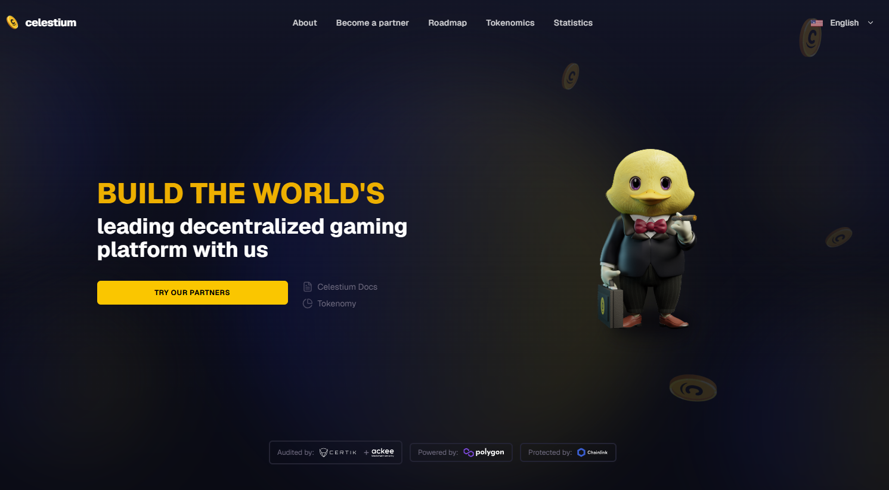

# 🌌 Celestium

<p align="center">
  
</p>

<p align="center">
  
  
  
  
  
  
  
</p>

---

# 🚀 Overview

Celestium is an immersive decentralized metaverse and blockchain gaming ecosystem built with modern Web3 technologies.

The platform combines multiplayer gameplay, NFT ownership, blockchain integration, AI systems, and real-time interactions to create a scalable next-generation gaming experience.

Celestium enables players to:

- 🌍 Explore virtual worlds
- 🎮 Play multiplayer games
- 🪙 Own blockchain-based assets
- 💰 Trade NFTs
- 🔗 Connect Solana wallets
- ⚡ Interact in real-time environments

---

# ✨ Features

- 🌌 Open World Metaverse
- 🎮 Multiplayer Gameplay
- 🔗 Solana Wallet Integration
- 🪙 NFT Asset Ownership
- 🛒 NFT Marketplace
- ⚡ Real-Time Multiplayer Sync
- 💬 Live Chat & Social Features
- 🏆 Global Leaderboards
- 📊 Player Statistics
- 🤖 AI-Powered Systems
- 🎨 Modern Responsive UI
- ☁️ Cloud-Ready Infrastructure
- 🐳 Docker Deployment Support

---

# 🧠 Tech Stack

## Frontend
- React 18
- Next.js 14
- TypeScript
- Tailwind CSS
- Framer Motion
- Three.js
- Babylon.js

## Backend
- Node.js
- Express.js
- Socket.IO
- TypeScript

## Blockchain
- Solana
- Web3.js
- Wallet Adapter

## Database
- MongoDB
- Redis

## DevOps
- Docker
- AWS
- Vercel
- GitHub Actions

---

# 📁 Project Structure

```text
├───.vscode
├───client
│   ├───public
│   └───src
│       ├───apis
│       ├───assets
│       │   ├───fonts
│       │   ├───game
│       │   │   ├───cards
│       │   │   └───cards-svg
│       │   ├───icons
│       │   └───img
│       ├───components
│       │   ├───buttons
│       │   ├───cookies
│       │   ├───decoration
│       │   ├───forms
│       │   ├───game
│       │   │   ├───Betslider
│       │   │   ├───BrandingImage
│       │   │   └───Seat
│       │   ├───icons
│       │   ├───layout
│       │   ├───loading
│       │   ├───logo
│       │   ├───modals
│       │   ├───navigation
│       │   ├───routing
│       │   ├───typography
│       │   └───user
│       ├───context
│       │   ├───game
│       │   ├───global
│       │   ├───localization
│       │   ├───modal
│       │   └───websocket
│       ├───game
│       ├───helpers
│       ├───hooks
│       ├───pages
│       │   └───ConnectWallet
│       ├───styles
│       └───utils
├───config
├───controllers
├───game
├───middleware
├───models
├───routes
│   └───api
├───socket
└───utils
```

---

# 🛠️ Prerequisites

Before starting, install the following:

- Node.js v18+
- npm or yarn
- Git
- MongoDB
- Solana CLI
- Phantom Wallet

---

# 🚀 Quick Start

## 1️⃣ Clone Repository

```bash
git clone https://github.com/CelestiumWorkHub/CelestiumVerse.git
cd celestium
```

---

## 2️⃣ Install Dependencies

```bash
npm install
```

or

```bash
yarn install
```

---

## 3️⃣ Configure Environment Variables

Create `.env` files inside both client and server folders.

---

## Frontend `.env`

```env
NEXT_PUBLIC_API_URL=http://localhost:4000
NEXT_PUBLIC_SOLANA_NETWORK=devnet
NEXT_PUBLIC_RPC_URL=https://api.devnet.solana.com
```

---

## Backend `.env`

```env
PORT=4000
MONGODB_URI=mongodb://localhost:27017/celestium
SOLANA_RPC_URL=https://api.devnet.solana.com
NODE_ENV=development
```

---

# ▶️ Run Development Servers

## Start Backend

```bash
cd server
npm run dev
```

---

## Start Frontend

```bash
cd client
npm run dev
```

---

# 🌐 Access Application

Frontend:

```bash
http://localhost:3000
```

Backend API:

```bash
http://localhost:4000
```

---

# 🔗 Wallet Integration

Celestium supports:

- Phantom Wallet
- Solflare
- Backpack Wallet
- Coinbase Wallet

Players can securely:

- Sign transactions
- Own NFTs
- Trade digital assets
- Join multiplayer gameplay

---

# 🎮 Gameplay Features

## 🌍 Open World Exploration

Explore immersive metaverse environments with real-time interactions.

---

## ⚔️ Multiplayer Battles

Fight against players in PvP arenas and cooperative missions.

---

## 🪙 NFT Economy

Own and trade unique blockchain-based digital assets.

---

## 🏆 Achievement System

Earn achievements, unlock rewards, and level up your profile.

---

# 📊 API Endpoints

## Authentication

```http
POST /api/auth/login
```

---

## User Profile

```http
GET /api/user/profile
```

---

## Leaderboards

```http
GET /api/leaderboards
```

---

## NFT Inventory

```http
GET /api/inventory
```

---

## Marketplace Listings

```http
GET /api/marketplace
```

---

# 🧪 Testing

Run all tests:

```bash
npm run test
```

---

## Frontend Tests

```bash
cd client
npm run test
```

---

## Backend Tests

```bash
cd server
npm run test
```

---

# 🐳 Docker Deployment

Start all services:

```bash
docker-compose up -d
```

---

## Stop Services

```bash
docker-compose down
```

---

# 🏗️ System Architecture

```text
+----------------------+
|      Frontend        |
| React / Next.js      |
| Three.js / Babylon   |
+----------+-----------+
           |
           v
+----------------------+
|      Backend API     |
| Node.js / Express    |
| Socket.IO            |
+----------+-----------+
           |
           v
+----------------------+
|      Blockchain      |
| Solana / Web3.js     |
| Smart Contracts      |
+----------+-----------+
           |
           v
+----------------------+
|      Database        |
| MongoDB / Redis      |
+----------------------+
```

---

# 🔐 Security

Celestium follows modern Web3 security practices:

- Wallet-based authentication
- Encrypted sessions
- Protected APIs
- Smart contract verification
- Rate limiting
- Infrastructure security

---

# 🗺️ Roadmap

- [x] Core Architecture
- [x] Wallet Integration
- [x] Multiplayer Support
- [x] NFT Integration
- [ ] NFT Marketplace
- [ ] AI NPC Systems
- [ ] DAO Governance
- [ ] Mobile Application
- [ ] VR Integration
- [ ] Token Staking

---

# 🤝 Contributing

Contributions are welcome.

## Steps

1. Fork repository
2. Create feature branch

```bash
git checkout -b feature/amazing-feature
```

3. Commit changes

```bash
git commit -m "Add amazing feature"
```

4. Push branch

```bash
git push origin feature/amazing-feature
```

5. Open Pull Request

---

# 📄 License

MIT License

---

# 👨‍💻 Developer

Built with passion by the Celestium Team.

---

# 📬 Contact

## GitHub

```text
https://github.com/CelestiumWorkHub/CelestiumVerse
```

## Twitter / X

```text
https://x.com/celestium
```

---

# 🙏 Acknowledgements

- Solana
- React
- Next.js
- Three.js
- Babylon.js
- MongoDB
- Tailwind CSS
- Open Source Community

---

# ⚖️ Disclaimer

This project is provided for educational and development purposes only.

Users are responsible for compliance with local blockchain and digital asset regulations.

---

<p align="center">
  🌌 Built for the Future of Web3 Gaming 🚀
</p>
